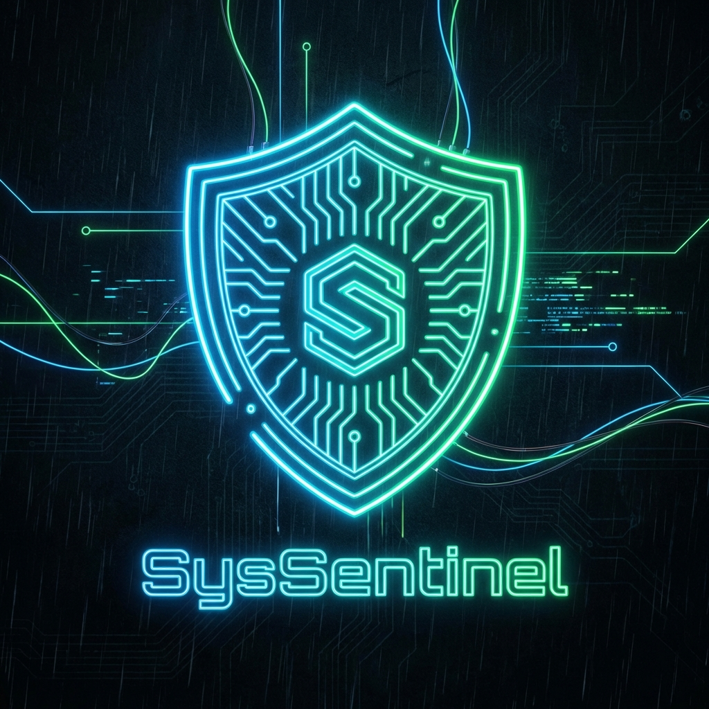

<div align="center">

# SENTINEL



### AI-Powered System Monitoring & Diagnostics Platform

[](https://www.python.org/)
[](https://flet.dev/)
[](https://www.microsoft.com/windows)
[](https://gpt4all.io/)
[](LICENSE)

<br/>

### 📥 Download

[](https://github.com/adidev001/SENTINEL/releases/latest)

> **[View all releases](https://github.com/adidev001/SENTINEL/releases)** | **Size:** ~150MB | **Platform:** Windows 10/11

<br/>

[Features](#-features) • [Quick Start](#-quick-start) • [Documentation](#-architecture) • [Build](#-building-from-source) • [Contributing](#-contributing)

---

</div>

## 📖 Overview

**SENTINEL** is an enterprise-grade system monitoring solution that combines real-time performance analytics with artificial intelligence to deliver predictive insights and automated diagnostics. Built as a standalone Windows application, SENTINEL eliminates the complexity of traditional monitoring tools while providing professional-level capabilities through an intuitive, cyberpunk-inspired interface.

### Key Capabilities

- **Comprehensive Monitoring** — Track CPU, memory, disk, network, and GPU metrics in real-time
- **AI-Powered Diagnostics** — Leverage local or cloud-based AI for intelligent system analysis
- **Anomaly Detection** — Machine learning algorithms identify unusual patterns before they become critical
- **Predictive Analytics** — Forecast resource usage trends to prevent system overload
- **Automated Response** — Configure intelligent alerts and process management rules
- **Zero Configuration** — Single executable deployment with no installation required

---

## ✨ Features

### 📊 Real-Time System Monitoring

<table>
<tr>
<td width="50%">

**Performance Metrics**
- CPU utilization with multi-core analysis
- Memory consumption and availability tracking
- Disk I/O rates and storage capacity
- Network throughput (upload/download)
- GPU monitoring via NVIDIA SMI integration

</td>
<td width="50%">

**Data Visualization**
- Historical trend charts with customizable timeframes
- Color-coded health indicators
- Percentage-based utilization displays
- Real-time graph updates (5-second intervals)
- Exportable metrics data

</td>
</tr>
</table>

### 🧠 Artificial Intelligence Integration

<table>
<tr>
<td width="33%">

**Local AI Engine**
- Offline diagnostics using GPT4All
- Orca Mini 3B model (~4GB)
- Privacy-focused local processing
- No internet dependency

</td>
<td width="33%">

**Cloud AI Engine**
- OpenRouter API integration
- Enhanced analysis capabilities
- Real-time threat intelligence
- Natural language queries

</td>
<td width="33%">

**ML Analytics**
- Isolation Forest anomaly detection
- Time-series forecasting
- Pattern recognition algorithms
- Behavioral baselining

</td>
</tr>
</table>

### 🔔 Intelligent Alert System

- **Multi-Channel Notifications**
  - Native Windows toast notifications
  - Email alerts via SMTP
  - Webhook integrations for third-party services
  - Customizable notification templates

- **Smart Throttling**
  - Prevents alert fatigue through intelligent rate limiting
  - Configurable cooldown periods
  - Priority-based alert routing

- **Threshold Management**
  - Granular control over warning and critical levels
  - Per-metric threshold configuration
  - Dynamic threshold adjustment based on historical data

### ⚙️ Process Automation

| Feature | Description |
|---------|-------------|
| **Auto-Restart** | Monitor critical processes and automatically restart on failure |
| **Priority Management** | Dynamically adjust process priorities based on system load |
| **Custom Metrics** | Define and track custom system commands and scripts |
| **Scheduled Actions** | Time-based automation rules for routine maintenance |

### 🔒 Enterprise Security

- **Credential Management** — Windows Credential Manager integration via keyring
- **Encrypted Storage** — API keys and sensitive data never stored in plain text
- **Access Control** — Per-user configuration and data isolation
- **Audit Logging** — Comprehensive activity tracking for compliance

---

## 🏗️ Architecture

SENTINEL employs a modular, event-driven architecture designed for performance, scalability, and maintainability.

```
┌───────────────────────────────────────────────────────────────────────────┐
│                          SENTINEL Application Layer                        │
├───────────────────────────────────────────────────────────────────────────┤
│                                                                            │
│  ┌─────────────────┐        ┌─────────────────┐        ┌──────────────┐  │
│  │  Presentation   │        │   Application   │        │     Data     │  │
│  │     Layer       │◄──────►│     Layer       │◄──────►│    Layer     │  │
│  │                 │        │                 │        │              │  │
│  │  • Flet UI      │        │  • Event Bus    │        │  • SQLite    │  │
│  │  • Dashboard    │        │  • Scheduler    │        │  • Metrics   │  │
│  │  • Analytics    │        │  • State Mgmt   │        │  • Models    │  │
│  │  • AI Chat      │        │  • AsyncIO      │        │  • Cache     │  │
│  │  • Settings     │        │                 │        │              │  │
│  └─────────────────┘        └─────────────────┘        └──────────────┘  │
│           │                          │                          │         │
│           └──────────────────────────┼──────────────────────────┘         │
│                                      │                                    │
│                                      ▼                                    │
│                          ┌─────────────────────┐                          │
│                          │   Service Layer     │                          │
│                          │                     │                          │
│                          │  ┌───────────────┐ │                          │
│                          │  │  Collectors   │ │                          │
│                          │  │  • CPU/Memory │ │                          │
│                          │  │  • Disk/Net   │ │                          │
│                          │  │  • GPU        │ │                          │
│                          │  └───────────────┘ │                          │
│                          │                     │                          │
│                          │  ┌───────────────┐ │                          │
│                          │  │  Intelligence │ │                          │
│                          │  │  • AI Engines │ │                          │
│                          │  │  • ML Models  │ │                          │
│                          │  │  • Forecaster │ │                          │
│                          │  └───────────────┘ │                          │
│                          │                     │                          │
│                          │  ┌───────────────┐ │                          │
│                          │  │  Automation   │ │                          │
│                          │  │  • Alerts     │ │                          │
│                          │  │  • Actions    │ │                          │
│                          │  │  • Notifiers  │ │                          │
│                          │  └───────────────┘ │                          │
│                          └─────────────────────┘                          │
│                                                                            │
└───────────────────────────────────────────────────────────────────────────┘
                                      │
                                      ▼
                          ┌─────────────────────┐
                          │  External Systems   │
                          │                     │
                          │  • NVIDIA SMI       │
                          │  • Windows APIs     │
                          │  • Email SMTP       │
                          │  • Webhooks         │
                          │  • OpenRouter API   │
                          └─────────────────────┘
```

### Component Overview

| Layer | Components | Responsibility |
|-------|-----------|----------------|
| **Presentation** | UI Components, Pages, Theme | User interface rendering and interaction |
| **Application** | Event Bus, Scheduler, State Manager | Application logic and coordination |
| **Service** | Collectors, Intelligence, Automation | Core business logic and processing |
| **Data** | SQLite, Metrics Store, Model Cache | Data persistence and retrieval |

---

## 📁 Project Structure

```
SENTINEL/
│
├── 📄 main.py                          # Application entry point
├── 🔧 build.ps1                        # PyInstaller build automation
├── 📋 requirements.txt                 # Python dependencies
│
├── 🎨 assets/
│   ├── icon.ico                        # Windows application icon
│   ├── icon.png                        # PNG icon source
│   └── background.png                  # UI background image
│
├── 📦 app/
│   │
│   ├── ⚙️ core/                        # Core Infrastructure
│   │   ├── event_bus.py                # Pub/sub event system
│   │   ├── scheduler.py                # Task scheduling
│   │   └── state.py                    # Application state management
│   │
│   ├── 📊 collectors/                  # Metric Collection
│   │   ├── cpu_collector.py            # CPU usage tracking
│   │   ├── memory_collector.py         # Memory statistics
│   │   ├── disk_collector.py           # Disk I/O and capacity
│   │   ├── network_collector.py        # Network throughput
│   │   └── gpu_collector.py            # NVIDIA GPU metrics
│   │
│   ├── 💾 storage/                     # Data Persistence
│   │   ├── database.py                 # SQLite connection manager
│   │   ├── reader.py                   # Data retrieval queries
│   │   └── writer.py                   # Data insertion logic
│   │
│   ├── 🤖 ml/                          # Machine Learning
│   │   ├── anomaly_detector.py         # Isolation Forest implementation
│   │   ├── forecaster.py               # Time-series prediction
│   │   └── normalizer.py               # Data preprocessing
│   │
│   ├── 🧠 intelligence/                # AI Engines
│   │   ├── local_engine.py             # GPT4All integration
│   │   ├── cloud_engine.py             # OpenRouter API client
│   │   └── health_state.py             # System health analyzer
│   │
│   ├── 🎯 logic/                       # Business Logic
│   │   ├── decision_engine.py          # Alert decision making
│   │   └── action_router.py            # Action execution routing
│   │
│   ├── 🔔 notifications/               # Alert Delivery
│   │   ├── toast_notifier.py           # Windows toast notifications
│   │   ├── throttle.py                 # Rate limiting
│   │   └── rules.py                    # Notification rules engine
│   │
│   ├── 🚨 alerts/                      # Alert Management
│   │   └── alert_manager.py            # Alert orchestration
│   │
│   ├── 🔄 automation/                  # Process Automation
│   │   └── process_automation.py       # Process monitoring and control
│   │
│   ├── 🤖 ai/                          # AI Model Management
│   │   └── model_manager.py            # GPT4All model handler
│   │
│   └── 🎨 ui/                          # User Interface
│       ├── components/                 # Reusable UI components
│       │   ├── metric_card.py          # Metric display cards
│       │   ├── health_badge.py         # Status indicators
│       │   └── charts.py               # Visualization charts
│       │
│       ├── pages/                      # Application pages
│       │   ├── dashboard.py            # Main monitoring dashboard
│       │   ├── analytics.py            # Historical analytics
│       │   ├── ai_chat.py              # AI diagnostic interface
│       │   └── settings.py             # Configuration panel
│       │
│       ├── app_shell.py                # Main application shell
│       ├── sidebar.py                  # Navigation sidebar
│       └── theme.py                    # Cyberpunk theme colors
│
└── 📦 dist/
    └── SENTINEL.exe                    # Standalone executable (~150MB)
```

---

## 🚀 Quick Start

### Option 1: Standalone Executable (Recommended)

**System Requirements:**
- Windows 10/11 (64-bit)
- 4GB RAM minimum (8GB recommended)
- 500MB free disk space
- NVIDIA GPU (optional, for GPU monitoring)

**Installation Steps:**

1. Download the latest release from the `dist/` directory
2. Double-click `SENTINEL.exe` to launch
3. Application data will be stored in `%APPDATA%\SENTINEL\`

No installation, configuration files, or dependencies required.

### Option 2: Run from Source

**Prerequisites:**
- Python 3.11 or higher
- pip package manager
- Virtual environment (recommended)

**Setup Instructions:**

```powershell
# Clone the repository
git clone https://github.com/adidev001/SENTINEL.git
cd SENTINEL

# Create and activate virtual environment
python -m venv .venv
.\.venv\Scripts\Activate.ps1

# Install dependencies
pip install -r requirements.txt

# Launch application
python main.py
```

---

## 🔨 Building from Source

### Build Prerequisites

- Python 3.11+
- Virtual environment with all dependencies installed
- PowerShell execution policy allowing scripts

### Build Process

```powershell
# Ensure virtual environment is activated
.\.venv\Scripts\Activate.ps1

# Execute build script
.\build.ps1

# Output location
# dist/SENTINEL.exe (~150MB)
```

### Build Configuration

The build process uses PyInstaller with the following optimizations:

- **Bundling Mode:** Single-file executable
- **Compression:** UPX compression enabled
- **Dependencies:** All Python packages and assets embedded
- **Icon:** Custom application icon included
- **Console:** Hidden for production builds

---

## ⚙️ Configuration

### AI Mode Selection

Access AI configuration through **Settings → AI Configuration**

| Mode | Description | Requirements | Use Case |
|------|-------------|--------------|----------|
| **Local** | GPT4All (Orca Mini 3B) | ~4GB disk space for model download | Privacy-focused, offline diagnostics |
| **Cloud** | OpenRouter API | API key from openrouter.ai | Enhanced analysis, multi-model access |
| **Disabled** | AI features turned off | None | Minimal resource usage, metrics-only monitoring |

### Alert Threshold Configuration

Customize warning and critical thresholds through **Settings → Alert Configuration**

| Metric | Default Warning | Default Critical | Recommended Range |
|--------|----------------|------------------|-------------------|
| **CPU Usage** | 75% | 90% | Warning: 60-80%, Critical: 85-95% |
| **Memory Usage** | 80% | 95% | Warning: 70-85%, Critical: 90-98% |
| **Disk Usage** | 80% | 95% | Warning: 75-85%, Critical: 90-98% |
| **Network** | Custom | Custom | Based on connection capacity |

### Notification Channels

**Toast Notifications (Default)**
- Native Windows 10/11 notifications
- No configuration required
- Appears in Action Center

**Email Notifications (Optional)**
- Requires SMTP server configuration
- Configure in Settings → Notifications → Email
- Supports TLS/SSL encryption

**Webhook Integration (Optional)**
- POST requests to custom endpoints
- JSON payload with alert details
- Configurable retry logic

---

## 🛠️ Technology Stack

### Core Technologies

| Category | Technology | Version | Purpose |
|----------|-----------|---------|---------|
| **UI Framework** | [Flet](https://flet.dev) | 0.21+ | Cross-platform UI with Flutter rendering |
| **Language** | Python | 3.11+ | Core application logic |
| **Database** | SQLite | 3.x | Embedded metrics storage |
| **Packaging** | PyInstaller | Latest | Standalone executable creation |

### AI & Machine Learning

| Component | Technology | Purpose |
|-----------|-----------|---------|
| **Local AI** | GPT4All | Offline natural language diagnostics |
| **Cloud AI** | OpenRouter API | Enhanced cloud-based analysis |
| **Anomaly Detection** | Scikit-learn (Isolation Forest) | Unsupervised outlier detection |
| **Time Series** | Custom forecasting algorithms | Resource usage prediction |

### System Integration

| Component | Technology | Purpose |
|-----------|-----------|---------|
| **System Metrics** | psutil | CPU, memory, disk, network statistics |
| **GPU Monitoring** | nvidia-smi | NVIDIA GPU utilization tracking |
| **Notifications** | win11toast | Windows toast notification API |
| **Credentials** | keyring | Windows Credential Manager integration |
| **Email** | smtplib | Email alert delivery |

---

## 💾 Data Storage

### Storage Locations

All application data is stored in the user's AppData directory:

```
%APPDATA%\SENTINEL\
│
├── 📁 data\
│   └── sys_sentinel.db              # SQLite metrics database (auto-managed)
│
├── 📁 models\
│   └── orca-mini-3b-gguf2-q4_0.gguf # GPT4All model (~4GB, downloaded on first use)
│
└── 📁 logs\
    └── debug.log                     # Application debug logs (rotated daily)
```

### Database Schema

**Metrics Table:**
- Timestamp (PRIMARY KEY)
- CPU percentage
- Memory used/total
- Disk used/total
- Network sent/received
- GPU utilization (if available)

**Anomalies Table:**
- Detection timestamp
- Metric type
- Anomaly score
- Contextual data

---

## 🐛 Troubleshooting

### Common Issues

<details>
<summary><b>Dashboard shows 0% or N/A for all metrics</b></summary>

**Cause:** Collectors haven't completed their first cycle

**Solution:**
- Wait 5-10 seconds after launch
- Check `%APPDATA%\SENTINEL\logs\debug.log` for errors
- Verify psutil is installed: `pip show psutil`

</details>

<details>
<summary><b>AI Chat returns errors or no response</b></summary>

**For Local Mode:**
- Verify model downloaded: Check `%APPDATA%\SENTINEL\models\`
- Model download can take 5-10 minutes on first use
- Requires ~4GB free disk space

**For Cloud Mode:**
- Verify API key in Settings → AI Configuration
- Get API key from [OpenRouter](https://openrouter.ai/keys)
- Check internet connectivity

</details>

<details>
<summary><b>GPU monitoring shows N/A</b></summary>

**Requirements:**
- NVIDIA GPU with driver version 450.80 or higher
- `nvidia-smi` must be in system PATH

**Verification:**
```powershell
nvidia-smi
```

If command fails, reinstall NVIDIA drivers or add to PATH.

</details>

<details>
<summary><b>Application crashes on startup</b></summary>

**Debug Steps:**
1. Run from command line to see error messages:
   ```powershell
   SENTINEL.exe
   ```
2. Check debug log: `%APPDATA%\SENTINEL\logs\debug.log`
3. Verify Windows version: Windows 10 1809+ required
4. Disable antivirus temporarily (may block first run)

</details>

---

## 🤝 Contributing

We welcome contributions from the community! Here's how to get involved:

### Development Setup

```powershell
# Fork and clone the repository
git clone https://github.com/YOUR_USERNAME/SENTINEL.git
cd SENTINEL

# Create feature branch
git checkout -b feature/your-feature-name

# Install development dependencies
pip install -r requirements.txt

# Make your changes and test
python main.py

# Commit with descriptive message
git commit -m "feat: add new metric collector for battery status"

# Push to your fork
git push origin feature/your-feature-name
```

### Contribution Guidelines

- Follow PEP 8 style guidelines
- Add docstrings to all functions and classes
- Include unit tests for new features
- Update documentation as needed
- Ensure build script passes before submitting PR

### Areas for Contribution

- 📊 New metric collectors (battery, temperature, etc.)
- 🎨 UI/UX improvements and themes
- 🤖 Additional AI model integrations
- 🌐 Cross-platform support (Linux, macOS)
- 📝 Documentation and examples
- 🐛 Bug fixes and performance optimizations

---

## 📄 License

This project is licensed under the **MIT License** - see the [LICENSE](LICENSE) file for details.

```
Copyright (c) 2024 Devansh (adidev001)

Permission is hereby granted, free of charge, to any person obtaining a copy
of this software and associated documentation files (the "Software"), to deal
in the Software without restriction, including without limitation the rights
to use, copy, modify, merge, publish, distribute, sublicense, and/or sell
copies of the Software, and to permit persons to whom the Software is
furnished to do so, subject to the following conditions:

The above copyright notice and this permission notice shall be included in all
copies or substantial portions of the Software.

THE SOFTWARE IS PROVIDED "AS IS", WITHOUT WARRANTY OF ANY KIND, EXPRESS OR
IMPLIED, INCLUDING BUT NOT LIMITED TO THE WARRANTIES OF MERCHANTABILITY,
FITNESS FOR A PARTICULAR PURPOSE AND NONINFRINGEMENT.
```

---

## 🙏 Acknowledgments

- **Flet Team** - For the excellent cross-platform UI framework
- **GPT4All** - For providing accessible local AI models
- **OpenRouter** - For the multi-model cloud API
- **Open Source Community** - For the countless libraries that make this possible

---

## 📞 Support & Contact

<div align="center">

**Developer:** Devansh (adidev001)

[](https://github.com/adidev001)
[](https://github.com/adidev001/SENTINEL/issues)
[](https://github.com/adidev001/SENTINEL/discussions)

---

### ⭐ Star this repository if you find it useful!

<sub>Made with ❤️ and Python • Empowering users with intelligent system monitoring</sub>

</divr.